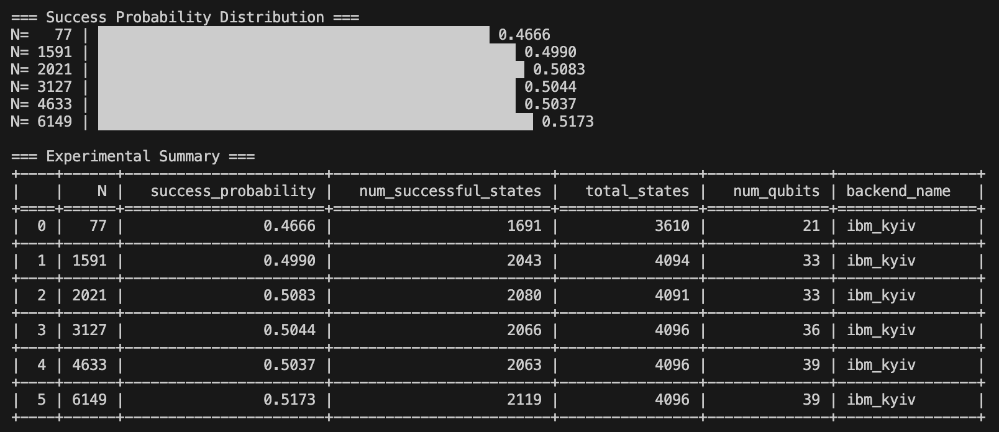
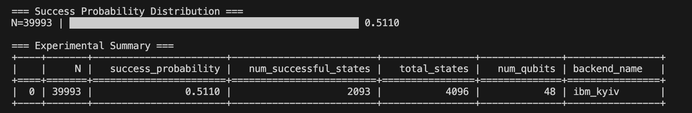

# Quantum Integer Factorization using Shor's Algorithm

This Python implementation uses Qiskit and IBM Quantum computers to perform integer factorization using Shor's algorithm. The program is designed to factor semiprime numbers using quantum computing resources. arbitraryNShor supports custom semiprime inputs -- 77from43 is a hardcoded solution for calculating the prime factors of 77.

## Features

- Implementation of Shor's period-finding algorithm using quantum circuits
- Automatic quantum backend selection using IBM's least busy backend
- Comprehensive measurement analysis and result processing
- Detailed success probability calculations
- Output generation in both CSV and human-readable formats

## Prerequisites

The following Python packages are required:

```bash
numpy
pandas
qiskit
qiskit-ibm-runtime
tabulate
```

## Configuration

Before running the script, you need to:

1. Obtain an IBM Quantum account and API token
2. Replace the token in the script with your own IBM Quantum API token
3. Configure the `NUMBERS_TO_TEST` list with the semiprime numbers you want to factor

## Key Components

### Main Functions

- `find_period(N, num_bits)`: Finds a value with a valid period modulo N and its transitions
- `c_amod_N(a, N, num_bits, transitions, power)`: Creates controlled multiplication circuits
- `qft_dagger(n)`: Implements the inverse quantum Fourier transform
- `run_shors_experiment(N)`: Main function that executes the complete Shor's algorithm

### Output Files

The script generates two CSV files:
- `shors_summary.csv`: Contains experiment summaries
- `shors_detailed.csv`: Contains detailed measurement results

## Hardware Limitations

- The maximum size of numbers that can be factored depends on the available quantum hardware
- Current maximum possible semiprime: 2,199,013,170,649
- Qubit count scales with input number size

## Example Usage

```python
# Set the numbers you want to factor
NUMBERS_TO_TEST = [1048574]

# Run the script
python arbitraryNShor.py
```

## Output Format

The program provides:
1. Real-time progress updates
2. Period-finding details
3. Top 10 measurement results for each run
4. Success probability distribution
5. Experimental summary table
6. Detailed CSV output files

## Implementation Notes

- The implementation uses adaptive counting qubits based on input size
- Uses 4096 shots per circuit execution

## Performance Considerations

- Success probability varies based on:
  - Input number size
  - Quantum backend quality
  - Number of measurement shots
  - Circuit optimization level
- Classical computation becomes burdensome for finding period of large numbers

## Example Results




